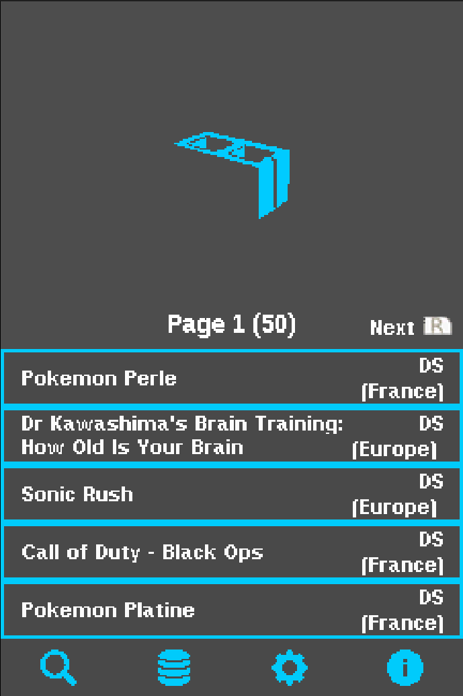
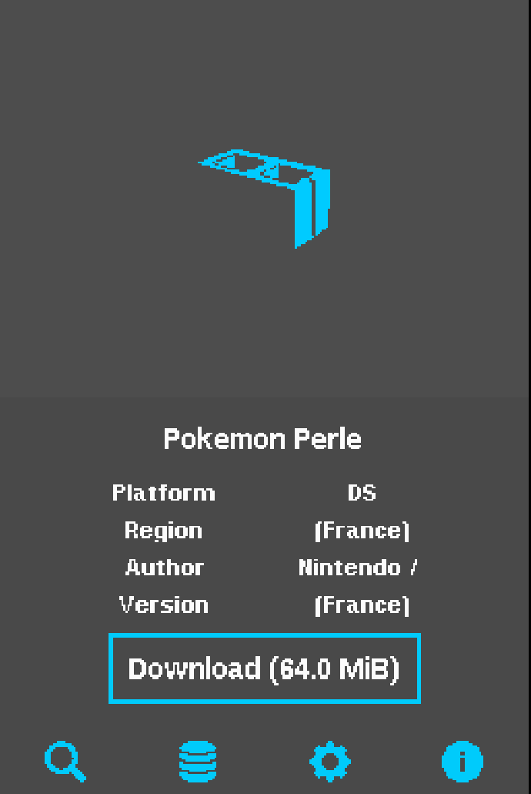
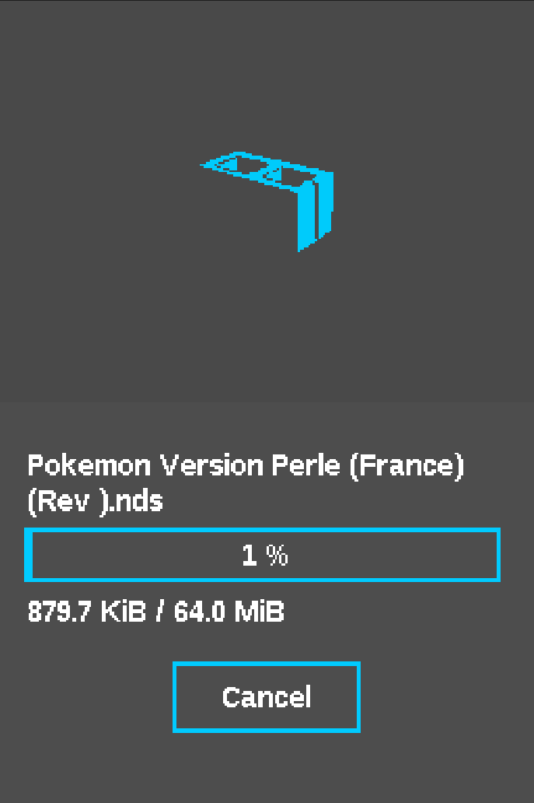

# NDS-Shop (DSi)

> An alternative Nintendo DS shop for the Nintendo DS / DSi family of systems.

## Features

- Browse and search a curated database of NDS games
- Download `.nds` directly to SD card
- ZIP file extraction
- Database loading via URL or file
- Multiple database support
- Automatic update check
- 7 customizable color schemes
- Multi-language support (EN, FR, NL, IT)

## Download

### DSi

- Download `NDS-Shop.nds` from the [latest release](https://github.com/NDS-Shop-Homebrew/NDS-Shop-DSi/releases/latest).
- Place it anywhere on your SD card.
- Launch via TWiLight Menu++ or Unlaunch.

## Building

### DSi

Requires [Wonderful Toolchain](https://wonderful.asie.pl/) + BlocksDS.

#### Windows (MSYS2)

```bat
compile.bat
clean.bat
```

#### Linux / macOS / WSL

```bash
# Install Wonderful Toolchain
curl -sL https://wonderful.asie.pl/install.sh | bash -s -- --no-interactive
source ~/.wonderful/env

# Build
python build.py

# Release build (outputs to release/)
python build.py release
```

## Screenshots

### DSi

<table>
<tr>
<td align="center"><b>Home</b></td>
<td align="center"><b>Browse</b></td>
<td align="center"><b>Settings</b></td>
</tr>
<tr>
<td></td>
<td></td>
<td></td>
</tr>
</table>

## 3DS Version

The 3DS port is maintained in a separate repository: [NDS-Shop](https://github.com/NDS-Shop-Homebrew/NDS-Shop)

## Credits

Based on [Kekatsu DS](https://github.com/cavv-dev/Kekatsu-DS) by cavv-dev (MIT licensed).
Database: [UDB-Kekatsu-DS](https://github.com/cavv-dev/UDB-Kekatsu-DS).
Concept inspired by [pkgi-psp](https://github.com/bucanero/pkgi-psp) and [Universal-Updater](https://github.com/Universal-Team/Universal-Updater).