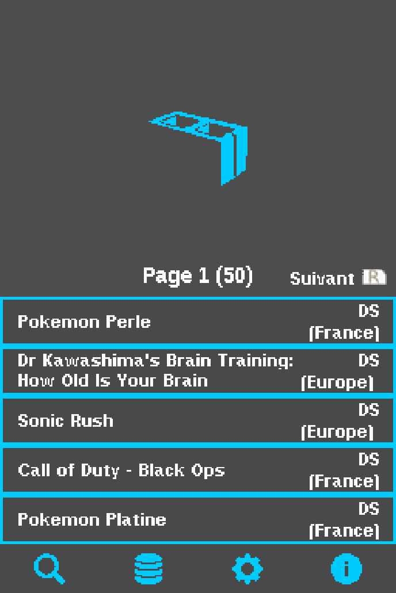
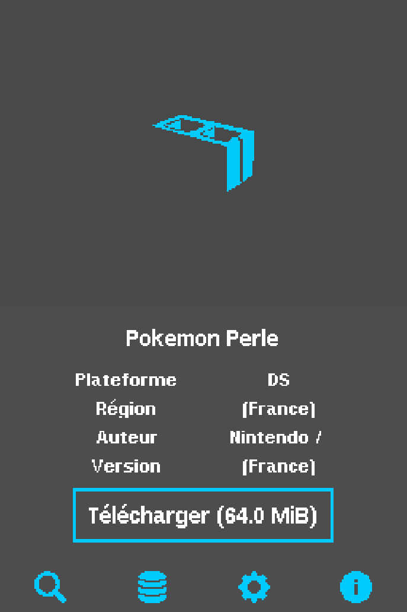
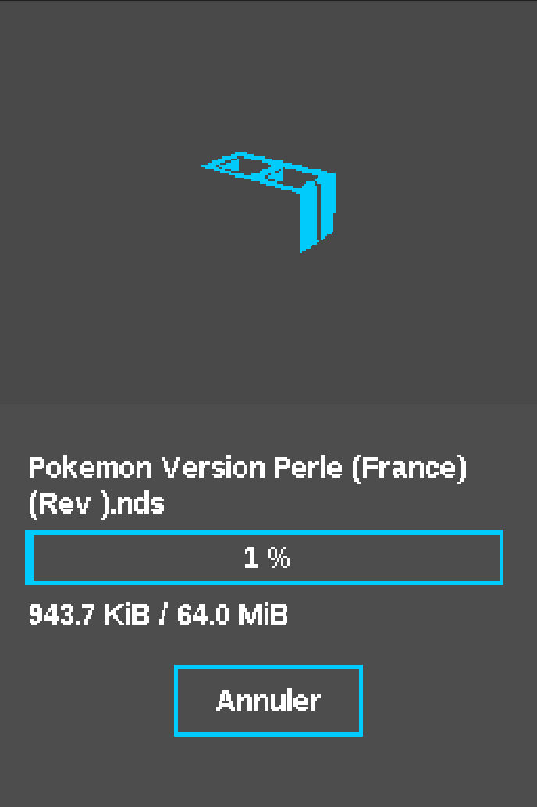

# NDS-Shop (DSi)

> Un magasin alternatif pour Nintendo DS, conçu pour les consoles Nintendo DS et DSi.

## Fonctionnalités

- Parcourir et rechercher une base de données de jeux NDS
- Télécharger les `.nds` directement sur la carte SD
- Extraction de fichiers ZIP
- Chargement de bases de données via URL ou fichier
- Support de plusieurs bases de données
- Vérification automatique des mises à jour
- 7 schémas de couleurs personnalisables
- Support multi-langues (EN, FR, NL, IT)

## Téléchargement

### DSi

- Téléchargez `NDS-Shop.nds` depuis la [dernière release](https://github.com/NDS-Shop-Homebrew/NDS-Shop-DSi/releases/latest).
- Placez-le n'importe où sur votre carte SD.
- Lancez via TWiLight Menu++ ou Unlaunch.

## Compilation

### DSi

Nécessite [Wonderful Toolchain](https://wonderful.asie.pl/) + BlocksDS.

#### Windows (MSYS2)

```bat
compile.bat
clean.bat
```

#### Linux / macOS / WSL

```bash
# Installer Wonderful Toolchain
curl -sL https://wonderful.asie.pl/bootstrap/wf-installer.sh | bash -s -- --no-interactive
source ~/.wonderful/env

# Compiler
python build.py

# Build release (sortie dans release/)
python build.py release
```

## Captures d'écran

### DSi

<table>
<tr>
<td align="center"><b>Accueil</b></td>
<td align="center"><b>Parcourir</b></td>
<td align="center"><b>Paramètres</b></td>
</tr>
<tr>
<td></td>
<td></td>
<td></td>
</tr>
</table>

## Version 3DS

Le port 3DS est maintenu dans un dépôt séparé : [NDS-Shop](https://github.com/NDS-Shop-Homebrew/NDS-Shop)

## Crédits

Basé sur [Kekatsu DS](https://github.com/cavv-dev/Kekatsu-DS) par cavv-dev (licence MIT).
Base de données : [UDB-Kekatsu-DS](https://github.com/cavv-dev/UDB-Kekatsu-DS).
Concept inspiré par [pkgi-psp](https://github.com/bucanero/pkgi-psp) et [Universal-Updater](https://github.com/Universal-Team/Universal-Updater).